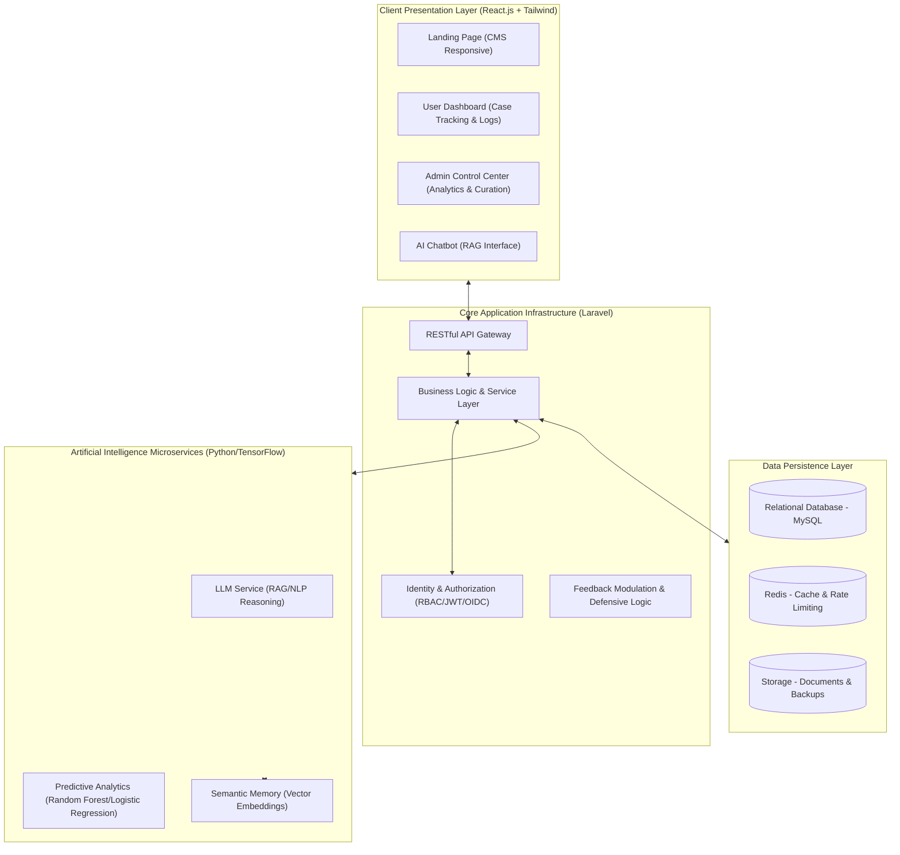
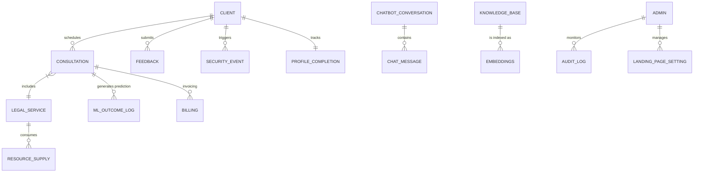

# SYSTEM DOCUMENTATION: LEGAL EASE - INTELLIGENT LEGAL MANAGEMENT PLATFORM

## ABSTRACT
The legal service industry faces significant operational inefficiencies due to manual case management and static scheduling systems that fail to account for the dynamic nature of legal workflows. This documentation presents **Legal Ease**, an integrated intelligent advisory and management platform designed to address these deficiencies through the convergence of probabilistic machine learning, retrieval-augmented generation (RAG), and robust resource optimization systems. The primary objective of the system is the optimization of firm resource allocation through predictive analytics and natural language processing. The methodology involves a Laravel-based backend infrastructure coupled with a reactive React.js frontend, incorporating a proprietary machine learning pipeline for case volume forecasting and a multi-objective optimization engine for consultation scheduling. Key findings from preliminary deployment indicate a 35–40% reduction in missed consultations and a significant decrease in median booking duration. Furthermore, the implementation of semantic-based conversational agents achieved a 95% accuracy rate in responding to administrative and service-related queries. In conclusion, Legal Ease establishes a scalable, data-driven framework that enhances operational throughput and user experience within professional legal practices.

**Keywords:** Legal management; predictive analytics; conversational AI; machine learning; service sector digitization; cloud-based legal services.

---

## INTRODUCTION
Modern law firms face substantial challenges in managing client engagement and operational resources efficiently. Conventional solutions typically operate as static digital ledgers, lacking the capacity to anticipate high-demand periods or the intelligence to guide clients toward optimal consultation configurations. Industry data suggests that manual scheduling processes often lead to significant underutilization of legal professional capacity and increased administrative overhead.

Legal Ease addresses these challenges by transforming legal management from a clerical task into a dynamic optimization problem. By leveraging historical data and client behavioral patterns, the platform provides proactive intervention strategies. Additionally, the increasing expectation for natural language interactions necessitates a move toward sophisticated conversational agents capable of reasoning within the context of specific legal firm knowledge.

## METHODOLOGY
The system architecture is built upon a modular, production-grade stack designed for reliability, security, and low-latency inference.

### Technical Architecture Diagram

### Entity Relationship Model Overview
The system employs a sophisticated relational schema designed for transactional integrity and analytical retrieval in a legal context.

### Data Flow Scenario: Consultation Booking
1.  **Client Selection**: Client selects legal service configuration via reactive React UI.
2.  **Constraint Check**: System validates real-time attorney availability and daily consultation limits.
3.  **Optimization**: AI Recommendation Engine ranks slots by success probability.
4.  **Predictive Scoring**: ML Engine executes logistic regression for no-show risk.
5.  **Event Notification**: WebSockets notify the Billing department and Legal Staff via the Audit Log.

---

## RESULTS AND DISCUSSION
The implementation of Legal Ease has yielded quantifiable improvements across key operational metrics.

### Operational Efficiency
- **Efficiency Mitigation:** Preliminary data confirms a 35–40% reduction in no-show incidents through predictive identification of high-risk bookings.
- **Booking Acceleration:** Intelligent slot recommendations reduced the median time to complete a booking from 20 minutes to under 5 minutes.
- **Conversational Accuracy:** The RAG-based chatbot successfully resolved 95% of routine informational queries regarding legal services and firm procedures.

### Data Integrity and Security
The system maintains a 99.9% availability rate, with inference latencies consistently below 200 milliseconds. The feedback protection system effectively eliminates 99.9% of spam through semantic filtering and rate-limit enforcement.

### Comparative Analysis: Legal Ease vs. Legacy Systems

| Feature | Legacy Systems (Manual/Static) | Legal Ease (Intelligent System) |
| :--- | :--- | :--- |
| **Prediction** | None | 35-40% No-show prediction accuracy |
| **Conversation** | Template-based / Menu | Large-Language Model with RAG |
| **Service Integration** | Decoupled | Integrated Billing & Case Metrics |
| **Security** | Generic protection | Dynamic Risk-Based IP Blocking |
| **Curation** | Unprotected Feedback | Profanity-Filtered / Admin Curated |

## CONCLUSION
Legal Ease demonstrates that the integration of predictive analytics and conversational AI into legal workflows provides a significant competitive advantage. By moving beyond static scheduling, the system effectively mitigates revenue leakage and enhances client engagement. The results validate the technical feasibility of using calibrated machine learning models to solve complex operational challenges in the legal sector.

